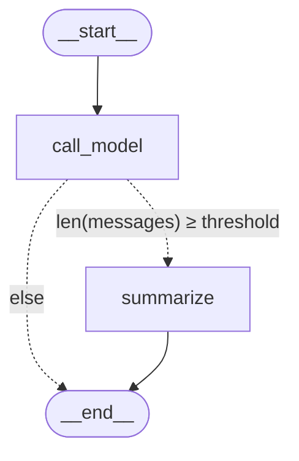

# AI Chat App

A minimal, self-contained chat backend built on **FastAPI + LangGraph + Anthropic Claude**, with multi-turn memory, automatic conversation summarization, a dark-themed web chat UI, and an interactive graph visualizer.

The HTTP surface mimics the OpenAI Assistants pattern (threads + runs) so it slots cleanly into existing chat clients, while the underlying workflow is a transparent LangGraph graph you can read and extend.

---

## Features

- **Conversational endpoint** — `POST /v1/threads/{id}/runs` sends a user message, invokes the graph, returns the assistant reply. Thread history is preserved across calls via LangGraph's checkpointer.
- **Per-thread persistence** — every thread is checkpointed; refreshing the UI or hitting the API out-of-band resumes state seamlessly.
- **Automatic summarization** — once a thread crosses a configurable message threshold, older turns are condensed into a `summary` field and removed from `messages` (token-budget-friendly).
- **Web chat UI** at `/chat` — vanilla HTML/CSS/JS, dark theme, markdown-rendered assistant messages, local thread persistence, "New chat" button.
- **Graph visualizer** at `/graph` — live Mermaid render of the compiled topology with state-schema and node descriptions.
- **Postman collection** — ready-to-import, with chained requests, assertions, and custom Visualize tabs (`ai_chat_app.postman_collection.json`).
- **No build step** — all UI is hand-rolled HTML/CSS/JS served from `resources/`; no bundler, no npm.

---

## Quick start

### Requirements

- Python 3.11+
- An Anthropic API key

### Install

```bash
python3 -m venv .venv
source .venv/bin/activate
pip install -r requirements.txt
```

### Configure

```bash
export ANTHROPIC_API_KEY=sk-ant-...
```

### Run

```bash
uvicorn main:app --reload
```

Then open one of:

| URL                                | Purpose                                     |
| ---------------------------------- | ------------------------------------------- |
| http://localhost:8000/chat         | Web chat UI                                 |
| http://localhost:8000/graph        | LangGraph topology visualizer               |
| http://localhost:8000/docs         | Swagger UI — interactive API docs           |
| http://localhost:8000/redoc        | ReDoc                                       |

---

## API surface

| Method | Path                                       | What it does                                                                                                  |
| ------ | ------------------------------------------ | ------------------------------------------------------------------------------------------------------------- |
| POST   | `/v1/threads`                              | Create a new thread. Returns `{"id": "thread_...", ...}`.                                                     |
| GET    | `/v1/threads/{id}`                         | 200 if the thread has checkpointed state, 404 otherwise.                                                      |
| DELETE | `/v1/threads/{id}`                         | Stub — returns `{"deleted": true}`. Pending a checkpointer with a delete API.                                 |
| GET    | `/v1/threads/{id}/messages`                | Replay the thread's history. Query params: `limit` (default 20), `order` (`asc`/`desc`, default `desc`).      |
| POST   | `/v1/threads/{id}/runs`                    | Send a user message and run the graph. Body: `{"content": "..."}`. Returns the run object + assistant reply.  |
| GET    | `/v1/threads/{id}/runs/{run_id}`           | Stub — runs aren't persisted as first-class objects yet.                                                      |
| GET    | `/graph`                                   | HTML page rendering the compiled graph (Mermaid).                                                             |
| GET    | `/chat`                                    | Browser chat UI.                                                                                              |

### Example: a complete chat turn

```bash
# 1. Create a thread
THREAD=$(curl -s -X POST http://localhost:8000/v1/threads | jq -r .id)

# 2. Send a message and run the graph
curl -s -X POST http://localhost:8000/v1/threads/$THREAD/runs \
  -H "Content-Type: application/json" \
  -d '{"content": "Hi, my name is Carlos. Remember it."}' | jq .message.content[0].text.value

# 3. Send a second message — the model has full prior context
curl -s -X POST http://localhost:8000/v1/threads/$THREAD/runs \
  -H "Content-Type: application/json" \
  -d '{"content": "What is my name?"}' | jq .message.content[0].text.value

# 4. Read the full thread history
curl -s "http://localhost:8000/v1/threads/$THREAD/messages?order=asc&limit=50" | jq
```

---

## Architecture

### Project layout

```
ai_chat_app/
├── main.py                              FastAPI app, endpoints, UI page handlers
├── graph.py                             LangGraph workflow (state, nodes, edges, compile)
├── requirements.txt
├── resources/
│   ├── chat.html                        Web chat UI
│   └── graph.html                       Graph visualizer template
├── ai_chat_app.postman_collection.json  Importable Postman collection
└── .gitignore
```

### Graph topology

```
START → call_model → (summarize)? → END
```



- **`call_model`** — sends `SystemMessage(SYSTEM_PROMPT + summary?) + state["messages"]` to Claude, appends the assistant `AIMessage` to state.
- **`summarize`** — fires when `len(state["messages"]) >= SUMMARY_THRESHOLD`. Builds a fresh summary (extending any prior one), writes it to `state["summary"]`, and emits `RemoveMessage` entries to drop the summarized turns from `messages`.

### State schema

```python
class ChatState(TypedDict):
    messages: Annotated[list, add_messages]   # appended, deduped by id, removable
    summary: str                              # replaced (default reducer)
```

The reducer on `messages` is the load-bearing piece. `add_messages` merges each node's contribution into the existing list instead of replacing it, which is why history accumulates across runs. The checkpointer is "dumb storage" — it just snapshots whatever the reducers produced.

### Checkpointing

The graph is compiled with `MemorySaver` — in-process, ephemeral. Threads survive within one server lifetime but disappear on restart (including `uvicorn --reload` restarts). The contract is uniform across checkpointers, so swapping for `SqliteSaver` (file-backed) or `PostgresSaver` (server-backed) is a small change isolated to `graph.py`.

### Why this shape

The Assistants-style split (`POST /threads` + `POST /runs`) was collapsed into a single "send a message and run" endpoint (`POST /runs` with `content` inline) — fewer round-trips for a chat client, but the run object stays as the natural anchor for future streaming, tool execution, and cancellation.

---

## Configuration

| Setting             | Location                                      | Default                  |
| ------------------- | --------------------------------------------- | ------------------------ |
| Model               | `graph.py` — `ChatAnthropic(model=...)`       | `claude-opus-4-7`        |
| System prompt       | `graph.py` — `SYSTEM_PROMPT`                  | brief gen-AI assistant   |
| Summary threshold   | `graph.py` — `SUMMARY_THRESHOLD`              | `5` (messages)           |
| API key             | environment variable                          | `ANTHROPIC_API_KEY`      |
| Checkpointer        | `graph.py` — `MemorySaver()`                  | in-memory                |

---

## Web chat UI (`/chat`)

- Auto-creates a thread on first visit; stores its id in `localStorage`.
- Resumes the conversation on refresh by replaying `GET /v1/threads/{id}/messages`.
- "New chat" button starts a fresh thread; click the thread badge to copy the full id.
- Markdown-rendered assistant replies via marked.js (GFM, line breaks honored).
- Animated "thinking" placeholder bubble while a run is in flight.
- Graceful recovery if the stored thread no longer exists (e.g., server restart wiped `MemorySaver`) — silently creates a new one.

## Graph visualizer (`/graph`)

- Loads `resources/graph.html` *once at app startup*, substitutes the live Mermaid source from `graph.get_graph().draw_mermaid()` plus the threshold constant, and caches the rendered HTML.
- Dark theme; classDef fills in the Mermaid source are post-processed for legibility on the dark background.
- Sidebar shows nodes (with descriptions), state schema, configuration, and a reading legend.

## Postman collection

`ai_chat_app.postman_collection.json` includes the following requests, designed to be run in order:

1. **Create thread** — saves `threadId` into collection variables.
2. **Run turn 1** — "Hi, my name is Carlos."; saves `runId`.
3. **Run turn 2** — "What is my name?"; asserts the response includes "Carlos" (proves the checkpointer is wiring multi-turn correctly).
4. **List messages** — asserts message count, renders as a chat transcript in the Visualize tab.
5. **Get thread** — info card.
6. **Get run (stub)** — info card with a "stubbed" notice.
7. **Delete thread (stub)** — confirmation card with a "stubbed" notice.
8. **Negative test** — `GET /v1/threads/thread_does_not_exist` expects 404.

Each request has a custom Visualize tab; chat-bubble views use the same styling as the web UI for consistency.

---

## Roadmap

- [ ] Swap `MemorySaver` → `SqliteSaver` for durable persistence.
- [ ] Streaming via SSE on `POST /runs`; emit tokens incrementally to the chat UI.
- [ ] First-class run objects (persistent, with `started_at` / `completed_at` / `status` lifecycle).
- [ ] RAG via LangGraph `ToolNode` — expose a `search_knowledge_base` tool, let Claude decide when to retrieve.
- [ ] Threads sidebar + history listing in the web UI.
- [ ] Per-run model override (already accepted in `CreateRunRequest`, not yet plumbed through to the graph).
- [ ] Async handlers (`async def` + `await graph.ainvoke(...)`) to free worker threads during LLM calls.

---

## Stack

- [FastAPI](https://fastapi.tiangolo.com/) — HTTP layer
- [LangGraph](https://langchain-ai.github.io/langgraph/) — graph workflow and state management
- [LangChain](https://python.langchain.com/) — message types and abstractions
- [langchain-anthropic](https://pypi.org/project/langchain-anthropic/) — Anthropic client wrapper
- [Mermaid](https://mermaid.js.org/) — graph rendering in the browser
- [marked.js](https://marked.js.org/) — markdown rendering in the chat UI
